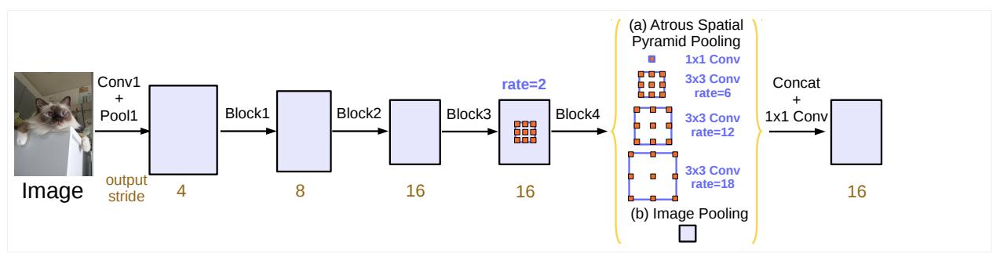

# Rethinking Atrous Convolution for Semantic Image Segmentation

### I. Architecture



### II. Usage

```shell
$ python3 deeplabv3.py
```

### III. Others

- Paper: [Rethinking Atrous Convolution for Semantic Image Segmentation](https://arxiv.org/pdf/1706.05587.pdf)