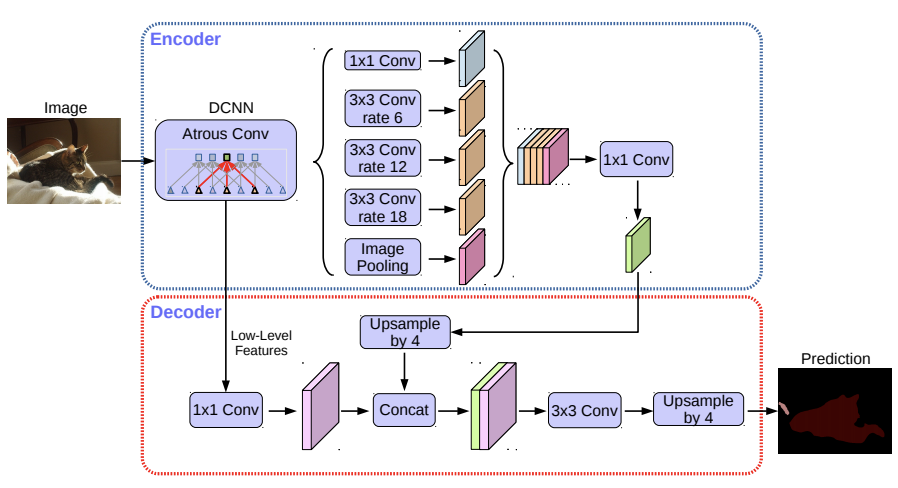

# Encoder-Decoder with Atrous Separable Convolution for Semantic Image Segmentation

### I. Architecture



### II. Usage

```shell
$ python3 deeplabv3plus.py
```

### III. Others

- Paper: [Encoder-Decoder with Atrous Separable Convolution for Semantic Image Segmentation](https://arxiv.org/pdf/1802.02611.pdf)