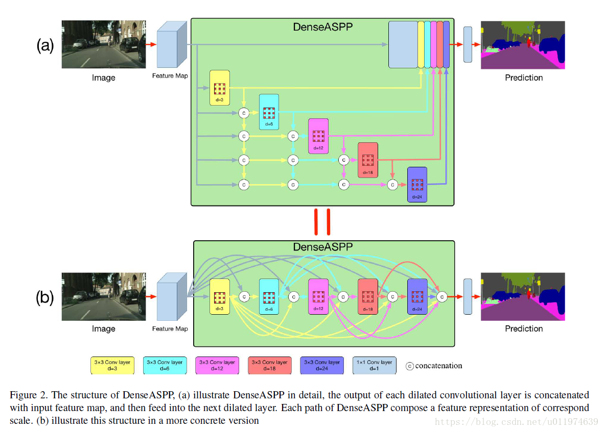

# DenseASPP for Semantic Segmentation in Street Scenes

### I. Architecture



### II. Usage

```shell
$ python3 denseaspp.py
```

### III. Others

- Paper: [DenseASPP for Semantic Segmentation in Street Scenes](http://openaccess.thecvf.com/content_cvpr_2018/papers/Yang_DenseASPP_for_Semantic_CVPR_2018_paper.pdf))