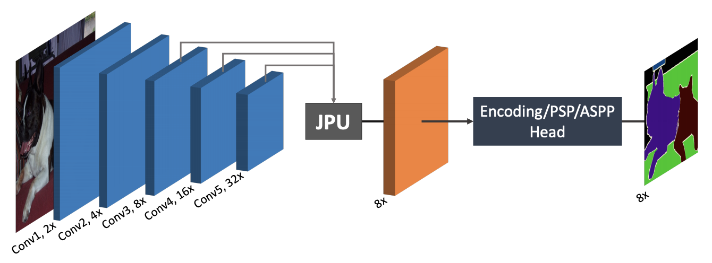

# FastFCN: Rethinking Dilated Convolution in the Backbone for Semantic Segmentation

### I. Architecture



### II. Usage

```shell
$ python3 fastfcn.py
```

### III. Others

- Paper: [FastFCN: Rethinking Dilated Convolution in the Backbone for Semantic Segmentation](https://arxiv.org/abs/1903.11816)