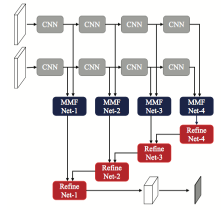

# RDFNet: RGB-D Multi-level Residual Feature Fusion for Indoor Semantic Segmentation

### I. Architecture



### II. Usage

```shell
$ python3 rdfnet.py
```

### III. Others

- Paper: [RDFNet: RGB-D Multi-level Residual Feature Fusion for Indoor Semantic Segmentation](http://openaccess.thecvf.com/content_ICCV_2017/papers/Park_RDFNet_RGB-D_Multi-Level_ICCV_2017_paper.pdf)