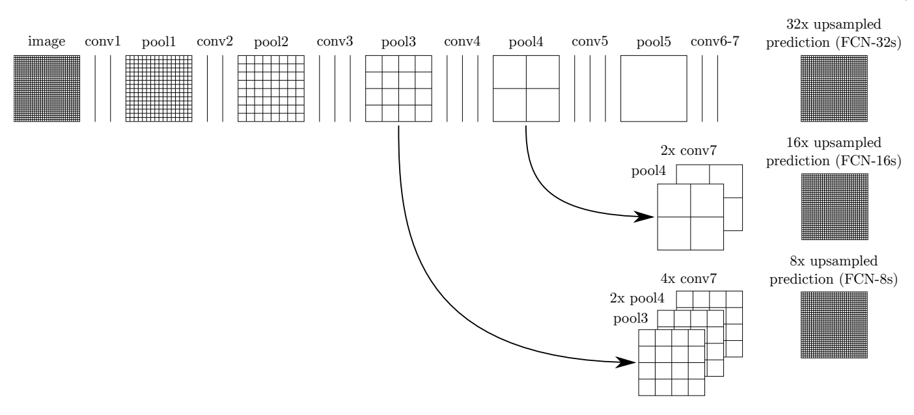
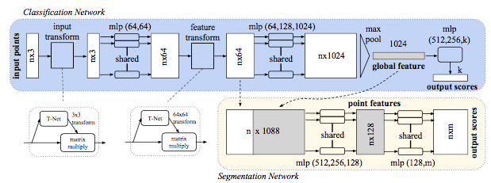
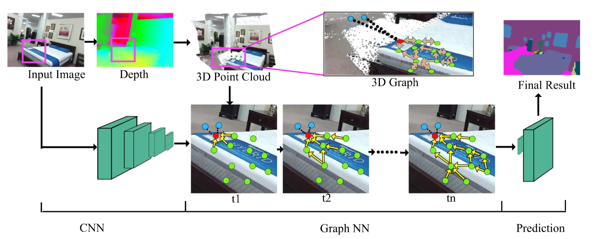

# PyTorch_Semantic_Segmentation

Implement some models of semantic segmentation in PyTorch, easy to run.

## Introduction

1. This repo includes some networks for **Semantic Segmentation** implemented in **pytorch 0.4.0** and **python3**. See each directory for more information.
2. I **only provide architecture of network** here. Dataset and train/test files aren't available here, for I think  it can be added according to individual needs.
3. The code file containing the network structure can be **run directly** with the set simulation data.

## Has finished

### FCN8s

### RefineNet

### DeepLab V3

### DeepLab V3+

### PointNet (CVPR 2017)

### 3DGNN (ICCV 2017)

