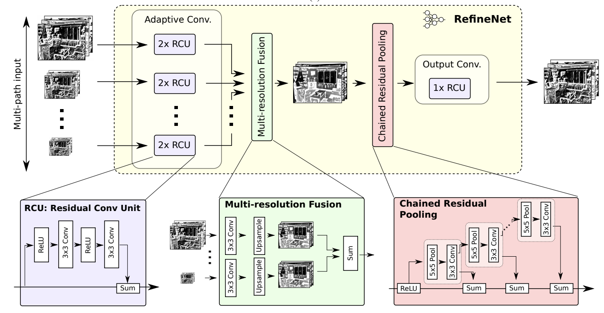

# RefineNet: Multi-Path Refinement Networks for High-Resolution Semantic Segmentation

### I. Architecture



### II. Usage

```shell
$ python3 RefineNet.py
```

### III. Others

- Paper: [RefineNet: Multi-Path Refinement Networks for High-Resolution Semantic Segmentation](https://arxiv.org/pdf/1611.06612.pdf)